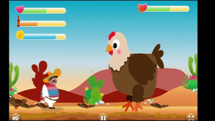

# 🐔 El Pollo Loco

A browser-based 2D jump & run game built with object-oriented JavaScript. Control "Pepe Peligroso" and fight off angry chickens in the Mexican desert.

## Preview



## Table of Contents

- [Installation](#installation)
- [How to Play](#how-to-play)
- [Key Features](#key-features)
- [Project Structure](#project-structure)
- [Technologies](#technologies)
- [License](#license)

## Installation

1. Clone the repository:
   ```bash
   git clone https://github.com/your-username/el-pollo-loco.git
   cd el-pollo-loco
   ```
2. Open the project folder and start a simple local server, for example with Live Server in VS Code.
3. Open `index.html` in your browser to play.

## How to Play

### Story

A horde of crazy chickens has taken over the Mexican desert! As Pepe Peligroso, your mission is to fight your way through the desert, collect resources, and defeat the final Boss Chicken to restore peace.

### Controls

- Desktop:

  | Keyboard key | Action             |
  | ------------ | ------------------ |
  | Left Arrow   | Move left          |
  | Right Arrow  | Move right         |
  | Space        | Jump               |
  | D            | Throw salsa bottle |

- Mobile:
  - Use the on-screen buttons to move, jump, and throw

### Gameplay

- Run left and right through the desert level
- Jump to dodge chickens or stomp them
- Collect coins to buy salsa bottles
- Throw salsa bottles to damage enemies from a distance
- Survive the final boss fight and reach victory

## Key Features

- Classic side-scrolling platformer gameplay
- Gravity-based jumping and projectile salsa bottle throws with animated splash effects
- Smooth sprite-based animations
- Collectible coins
- dynamic statusbars tracking health, bottles and coins
- Boss Chicken at the end of the level
- pause menu to restart, continue, go back to home or read the instructions
- mute toggle and fullscreen support
- Responsive controls for desktop and mobile

## Project Structure

```text
el-pollo-loco/
├── assets/             # Images, audio, fonts, and icons
├── levels/             # Level data and enemy placement
├── models/             # Main game object classes
│   ├── drawable-object.class.js
│   ├── movable-object.class.js
│   ├── character.class.js
│   ├── chicken.class.js
│   ├── endboss.class.js
│   ├── world.class.js
│   └── ...
├── scripts/            # UI, audio, and game logic helpers
├── style/              # CSS modules for buttons, overlays, and base styling
├── index.html          # Main entry point of the game
└── style.css           # Core page and game layout styling
```

## Technologies

- HTML5
- CSS3
- Vanilla JavaScript (ES6+)
- Canvas rendering
- Object-oriented programming (OOP)
- Audio and sprite-based animation
- LocalStorage

## License

This project was created for educational purposes.<br>
All game assets are used for educational and non-commercial purposes only.
